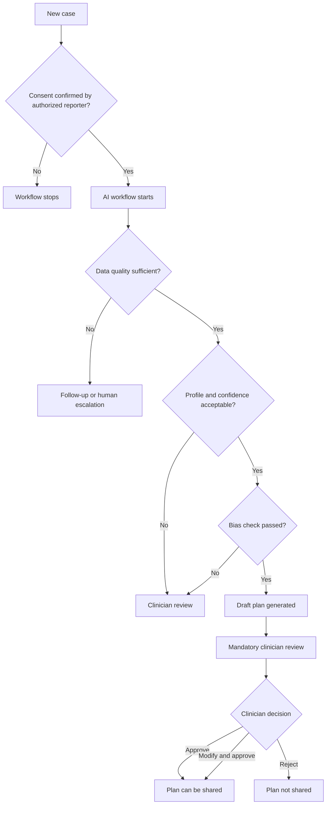

# Human-in-the-Loop Governance Document

## 1. Governance Principle

The application treats AI-generated intervention plans as drafts only. A caregiver-facing plan is not released until a qualified clinician explicitly approves or modifies and approves it.

This is enforced in the product experience, workflow design, review dashboard, review handler, and audit trail.

## 2. Human Roles

| Role | Access | Responsibility |
|---|---|---|
| Intake clinician | Intake page | Starts a child assessment, confirms consent, enters structured assessment and family context |
| Reviewing clinician | Review dashboard | Reviews AI output, checks clinical fit, makes approval decision |
| Caregiver | No direct AI access in current app | Receives only clinician-approved guidance |
| System administrator | Backend/config | Maintains thresholds, service configuration, audit access |

## 3. Mandatory Human Gates

## 4. Consent Gate

Where it appears:
- Intake page informed consent card.
- Backend `EthicsConsentAgent`.
- Workflow routing from `route_consent`.

Human action:
- The clinician confirms that parent/legal guardian consent has been obtained.

System behavior:
- If consent is granted, the workflow may continue.
- If consent is denied, the UI explains that processing cannot proceed.
- If consent is not granted in workflow state, routing ends the workflow.

## 5. Clinical Review Gate

Where it appears:
- `ReviewPage.jsx`
- `human_review_node`
- `clinician_review_handler.py`

Human action options:
- `approved`: Accept the draft plan.
- `modified`: Approve after clinician edits or notes.
- `rejected`: Reject the AI-generated plan.
- `partial_approved`: Supported by backend handler for partial approval workflows.

System behavior:
- Approved and modified plans become `approved`.
- Rejected plans become `rejected`.
- Review action, reviewer ID, notes, and modifications are stored.
- Clinician action is logged in the audit trail.

## 6. Reviewer Checklist

Before approving, the reviewing clinician should verify:

| Review Area | What to Check |
|---|---|
| Child profile | Age, support level, assessment scores, strengths, family priorities |
| Domain priorities | Correct order and clinical rationale for intervention focus |
| Guidelines | Fit with child profile, current services, family constraints, contraindications |
| SMART goals | Specific, measurable, achievable, relevant, time-bound, not vague |
| Milestones | Reasonable timeline and observable progress markers |
| Caregiver guidance | Parent-friendly, culturally sensitive, practical at home |
| Bias alerts | Any flagged bias concerns are clinically addressed |
| Audit trail | Agents completed expected steps and confidence is acceptable |

## 7. Escalation Triggers

The system should route or flag for human attention when:

| Trigger | Example | Human Response |
|---|---|---|
| No consent | Consent not granted | Stop workflow |
| Incomplete data | Missing age, assessment results, or support areas | Request more information |
| Conflicting data | Assessment scores conflict with narrative | Clinician reconciles |
| Low confidence | Agent confidence below threshold | Review or manually plan |
| Bias concern | Language, culture, or socioeconomic assumptions detected | Modify guidance |
| Clinical mismatch | AI suggests approach unsuitable for child | Reject or modify |
| Safety concern | Plan omits supervision or risk handling | Reject or escalate |

## 8. Audit Requirements

Every human and AI decision should be traceable.

Audit trail includes:
- Case ID.
- Agent ID or reviewer ID.
- Event type.
- Action.
- Timestamp.
- Confidence score when available.
- Input hash and output hash for agent steps.
- Reviewer notes for human decisions.

The review dashboard exposes the audit trail so reviewers can see how the plan was assembled.

## 9. Non-Negotiable Rule

No plan reaches a family without clinician approval.

This rule should remain visible in the review page and enforced server-side by plan status. Any future caregiver portal, email export, PDF generation, or delivery API must check that the plan status is `approved` before release.
