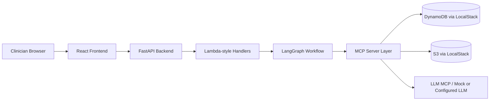

# Technical Document - Autism Intervention Guideline Generator

## 1. Purpose

The application is a governance-aware clinical decision support proof of concept for autism intervention planning. It takes structured child assessment data, runs a multi-agent planning workflow, and creates draft intervention plans that must be reviewed by a clinician before family delivery.

The system does not diagnose. It generates draft planning support: developmental priorities, intervention guidelines, SMART goals, milestones, caregiver guidance, confidence metadata, and an audit trail.

## 2. Runtime Architecture



| Layer | Implementation | Responsibility |
|---|---|---|
| Frontend | `frontend/src` | Dashboard, intake, clinician review |
| API | `backend/app.py` | REST routing and CORS |
| Lambda handlers | `backend/lambdas` | Case creation, workflow start, queries, review decisions |
| Workflow | `backend/workflow/graph.py` | LangGraph orchestration of 12 agents plus human review |
| Agents | `backend/agents` | Specialized planning and governance steps |
| MCP | `backend/mcp_servers` | Controlled access to DynamoDB, S3, audit, LLM, workflow state |
| Data | LocalStack DynamoDB/S3 | POC persistence and document storage |

## 3. Frontend Pages

### Dashboard

File: `frontend/src/pages/DashboardPage.jsx`

Primary user actions:
- View total children, plans awaiting clinician review, approved plans, delivered-to-family count.
- Filter by status.
- Navigate to a new child assessment.

APIs used:
- `GET /api/cases`
- `GET /api/reviews/pending`

### Intake

File: `frontend/src/pages/IntakePage.jsx`

Primary user actions:
- Create a new case.
- Confirm informed consent.
- Enter child information, assessment results, family context, strengths, support areas, priorities, and services.
- Start the multi-agent workflow.

APIs used:
- `POST /api/cases`
- `POST /api/cases/{case_id}/workflow/start`
- Optional chat: `POST /api/chat/{case_id}/message`

### Clinician Review

File: `frontend/src/pages/ReviewPage.jsx`

Primary user actions:
- Select a pending plan.
- Review developmental domain priorities, intervention guidelines, SMART goals, caregiver guidance, bias alerts, and governance audit trail.
- Approve, modify and approve, or reject.

APIs used:
- `GET /api/reviews/pending`
- `GET /api/cases/{case_id}/plan`
- `GET /api/cases/{case_id}/audit`
- `POST /api/cases/{case_id}/review`

## 4. Backend API Surface

| Endpoint | Method | Purpose |
|---|---|---|
| `/api/cases` | `POST` | Create new case |
| `/api/cases` | `GET` | List plans/cases |
| `/api/cases/{case_id}` | `GET` | Query case profile and plan summary |
| `/api/cases/{case_id}/workflow/start` | `POST` | Start LangGraph workflow |
| `/api/cases/{case_id}/workflow/state` | `GET` | Read latest workflow state |
| `/api/cases/{case_id}/plan` | `GET` | Read full intervention plan |
| `/api/cases/{case_id}/plan/domains` | `GET` | Read domain priorities |
| `/api/cases/{case_id}/plan/guidelines` | `GET` | Read intervention guidelines |
| `/api/cases/{case_id}/plan/goals` | `GET` | Read SMART goals |
| `/api/cases/{case_id}/plan/caregiver` | `GET` | Read caregiver guidance |
| `/api/reviews/pending` | `GET` | Load clinician review queue |
| `/api/cases/{case_id}/review` | `POST` | Record review decision |
| `/api/cases/{case_id}/audit` | `GET` | Load audit trail |

## 5. Workflow Agents

The workflow is defined in `backend/workflow/graph.py`.

| Step | Agent | Role |
|---:|---|---|
| 1 | `EthicsConsentAgent` | Verify consent before data processing |
| 2 | `InputAggregationAgent` | Normalize raw and structured assessment input |
| 3 | `DataQualityAgent` | Validate completeness and consistency |
| 4 | `ProfileSynthesisAgent` | Build strength-based child profile |
| 5 | `PredictionAgent` | Prioritize developmental domains |
| 6 | `ConfidenceAbstentionAgent` | Decide proceed, partial proceed, or abstain |
| 7 | `DomainAnalysisAgent` | Break domains into focus areas |
| 8 | `GuidelineGenerationAgent` | Generate evidence-informed intervention guidelines |
| 9 | `BiasMonitoringAgent` | Detect bias and cultural/language concerns |
| 10 | `GoalGenerationAgent` | Create SMART developmental goals |
| 11 | `MilestonePlanningAgent` | Create short-term and long-term milestones |
| 12 | `CaregiverGuidanceAgent` | Generate parent-friendly activities and strategies |
| 13 | `human_review_node` | Pause until clinician decision |

## 6. State Model

The shared workflow state is defined in `backend/workflow/state.py`. Important fields:

| Field | Meaning |
|---|---|
| `case_id`, `child_id` | Case and child identifiers |
| `consent_status` | Consent gate status |
| `structured_inputs`, `raw_inputs` | Intake data submitted by UI |
| `data_quality_score`, `data_quality_status` | Validation result |
| `child_profile`, `profile_confidence` | Synthesized child profile |
| `domain_priorities`, `prediction_confidence` | Ranked intervention priorities |
| `proceed_decision`, `abstention_reason` | Confidence gate result |
| `domain_analysis` | Focus areas per domain |
| `intervention_guidelines` | Draft intervention strategies |
| `bias_check_status`, `bias_concerns` | Bias monitoring output |
| `smart_goals`, `milestones` | Goal and progress plan |
| `caregiver_guidance` | Family-facing guidance draft |
| `plan_id` | Generated plan identifier |
| `clinician_review` | Human review action and notes |
| `agent_outputs`, `escalation_history` | Runtime trace |

## 7. Routing and Governance

Conditional routing is implemented in `backend/workflow/routing.py`.

| Route | Condition | Destination |
|---|---|---|
| Consent granted | `consent_status == GRANTED` | Input aggregation |
| Consent denied or pending | Anything else | End |
| Input error | `error` present | Human review |
| Data validated | `data_quality_status == VALIDATED` | Profile synthesis |
| Data follow-up | `FOLLOW_UP` and under max rounds | Data quality loop |
| Low profile confidence | Below threshold | Human review |
| Confidence proceed | `PROCEED` or `PARTIAL_PROCEED` | Domain analysis |
| Confidence abstain | Other decision | End |
| Bias passed | `bias_check_status == PASSED` | Goal generation |
| Bias failed | Any other bias status | Human review |

## 8. Audit and Traceability

All agents inherit from `BaseAgent`.

For each agent execution:
- Input data is hashed.
- Agent output is hashed.
- Agent output is persisted through `DynamoMCP`.
- Audit event is written through `AuditMCP`.
- Confidence score is attached when available.

This supports traceability for clinician review, governance checks, and later inspection of why a plan was generated.

## 9. Current Verification Surface

The repository currently does not include frontend unit tests, backend unit tests, or Playwright tests. The only local executable verification script found is:

```bash
python scripts/verify_infra.py
```

Recommended next tests:
- Backend API integration test for create case, start workflow, read review queue, submit review.
- Frontend flow test for dashboard to intake to consent to submit to review.
- Agent routing tests for consent denied, low data quality, low confidence, and bias failure.
